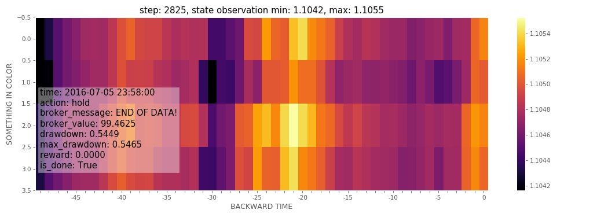

### BTgym examples and how-to's.

****

- **[Atari tests](./atari_tests)**: Gym-Atari tests for A3C, BaseAAC, PPO.

- **[A3C for BTgym](./a3c)**: TEMPORARILY OUT OF SERVICE

- **[BTgym setup for asynchronous training](./async_btgym_workers.ipynb)**: getting ready for A3C.

- **[Rendering howto](./rendering_howto.ipynb)**: get cool pictures.
    

- **[Tensorboard monitor](./tensorboard_monitor.ipynb)**: using it to track environment dynamics.
 After running the script and opening http://localhost:6006/ you should see something like this:

 

- **[Setting up environment [full]](./setting_up_environment_full.ipynb)**: do it like a Pro.

- **[Setting up environment [basic]](./setting_up_environment_basic.ipynb)**: making environment using basic built-in parameters.

 ****

  
 