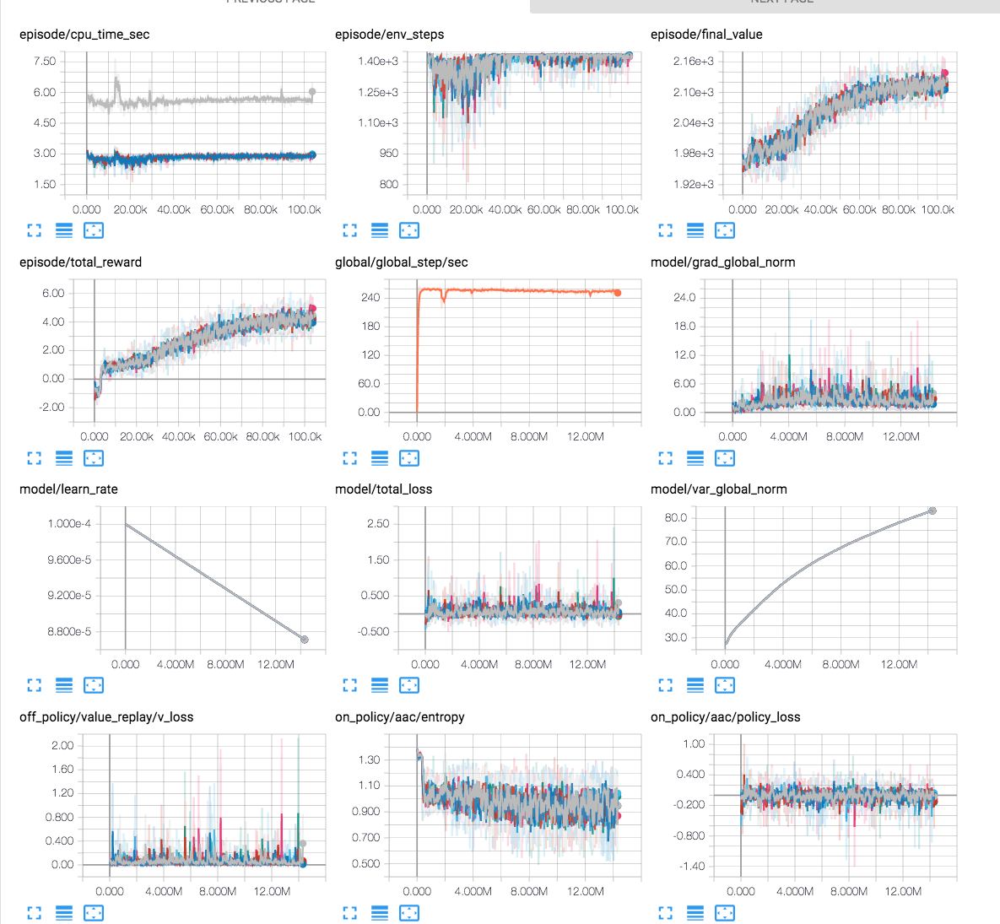
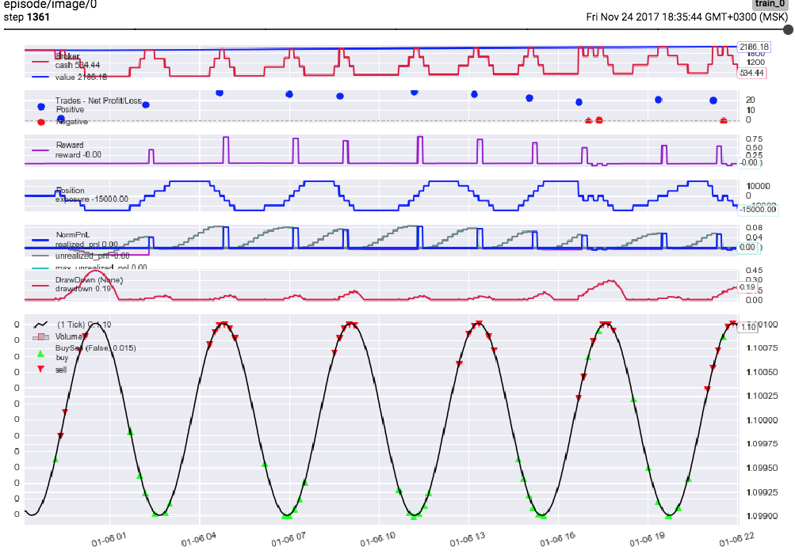

### BTgym examples and how-to's.

****

Develop_code 4.6 as of 24.11.17:

- **[A3C_4_6](./a3c_random_on_synth_or_real_data_4_6.ipynb)**: A3C demo on synthetic or real historic data 
- **[UNREAL_4_6](./unreal_random_on_synth_or_real_data_4_6.ipynb)**: UNREAL/PPO demo on synthetic or real historic data

  
****
- **[Atari tests](./atari_tests)**: Gym-Atari tests for A3C, BaseAAC, PPO.
****
- **[BTgym setup for asynchronous training](./async_btgym_workers.ipynb)**: getting ready for A3C.
****
- **[Rendering howto](./rendering_howto.ipynb)**: get cool pictures.
    

****
- **[Tensorboard monitor](./tensorboard_monitor.ipynb)**: using it to track environment dynamics.
 After running the script and opening http://localhost:6006/ you should see something like this:

 
****
- **[Setting up environment [full]](./setting_up_environment_full.ipynb)**: configure everything.

- **[Setting up environment [basic]](./setting_up_environment_basic.ipynb)**: making environment using basic built-in parameters.
****

  
 